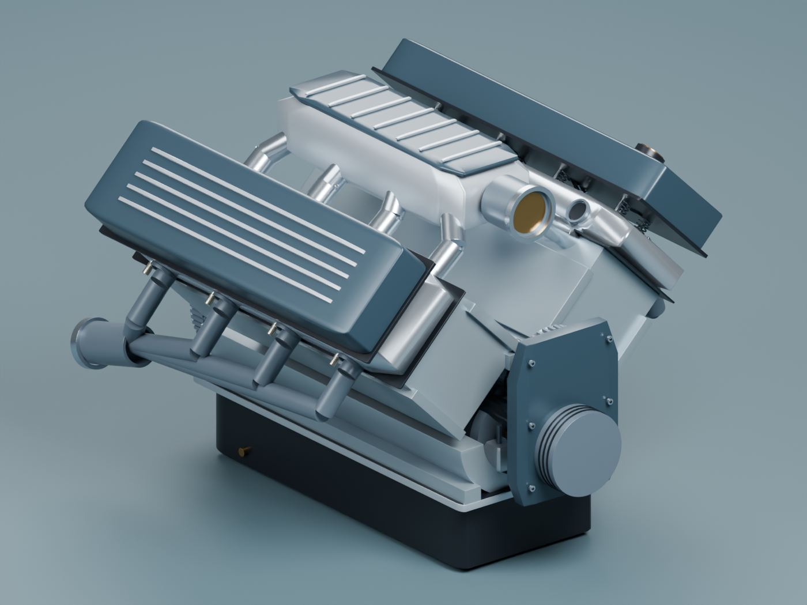
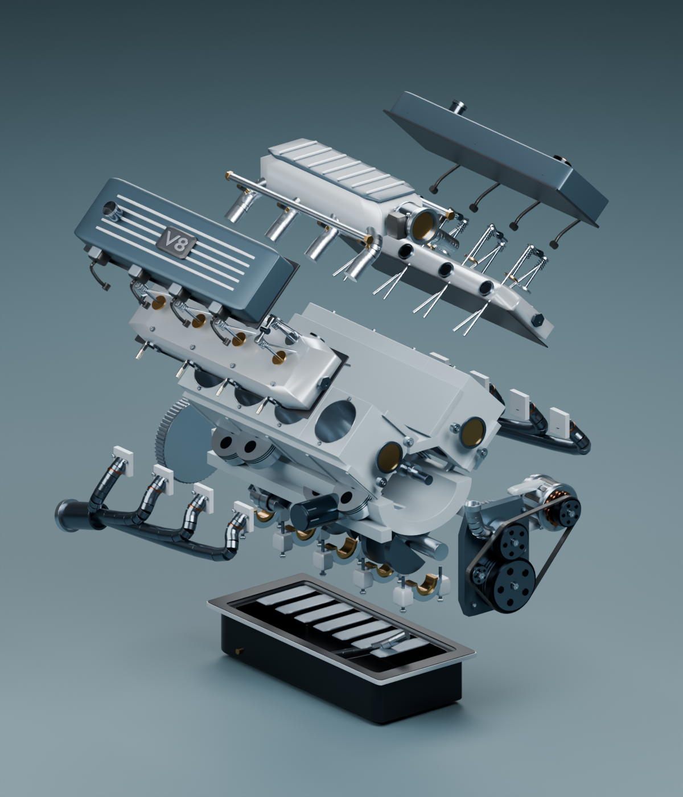

# Ignition Lab

A V8 engine built from equations, with an open Blender assembly. Turn the throttle, follow the pistons, watch pressure become work, and hear the exhaust pulses. Everything runs in the browser with **zero runtime dependencies**.

[](https://github.com/Berkay2002/ignition-lab/actions/workflows/checks.yml)
[](LICENSE)

**[Open the interactive lab](https://ignition-lab-berkay.vercel.app/)** · **[Project showcase](https://ignition-lab-berkay.vercel.app/showcase.html)** · **[Download the Blender scene](https://github.com/Berkay2002/ignition-lab/releases/latest)**

[](https://ignition-lab-berkay.vercel.app/)

## Try it

| Demo | What to explore |
| --- | --- |
| [Assembled](https://ignition-lab-berkay.vercel.app/?view=assembled) | Orbit the engine, click a part, hide or isolate its assembly. |
| [Cutaway](https://ignition-lab-berkay.vercel.app/?view=cutaway) | Follow the pistons, rods, and valve gear while the pressure loop advances. |
| [Exploded](https://ignition-lab-berkay.vercel.app/?view=exploded) | Separate the ten layers and inspect the block, heads, bearings, and sump. |

Drag to orbit, scroll to zoom, or focus the canvas and use the arrow keys. Select a cylinder to follow its cycle. Scrub crank angle to pause and inspect a moment. Adjust RPM, throttle, compression, and ignition advance to solve a new cycle. Sound starts only after you click **Start sound**; it follows engine RPM independently of the slower study animation.

## Calculus you can see

The cylinder volume comes from slider-crank geometry. A Wiebe burn curve releases heat into an ideal gas; a fourth-order Runge-Kutta integrator follows its energy through compression and expansion. The signed area inside the pressure-volume loop gives cycle work:

$$W = \oint p\,dV \qquad P_{ind} = 8W\frac{\mathrm{RPM}}{120}$$

The model uses prescribed RPM and a steady cycle. It does **not** simulate crank acceleration, chemical kinetics, CFD, knock, or mechanical losses. The sound is synthesized from exhaust events, not a recording. [Read the equations, assumptions, and validation](docs/model.md).

## Open 3D assets

865 named parts in ten groups: block, crank and pistons, main bearings, oil pan, cylinder heads, valvetrain, valve covers, intake, exhaust, and timing/flywheel. Details include bore liners, piston rings, fasteners, springs, ribbed covers, beveled castings, and hollow covers and sump.

| Asset | Use |
| --- | --- |
| [v8-engine.blend](https://raw.githubusercontent.com/Berkay2002/ignition-lab/main/v8-engine.blend) | Editable scene, named collections, materials, studio lights, and an explosion controller. Saved and checked in Blender 5.2.1. |
| [v8-engine.glb](https://raw.githubusercontent.com/Berkay2002/ignition-lab/main/v8-engine.glb) | Static assembled interchange model. |
| [Assembled render](v8-assembled.png) / [Exploded render](v8-exploded.png) | Full-resolution studio images. |

In Blender, select **Assembly controls** and change its **explode** custom property. The saved scene has a zero-degree mechanical pose; JavaScript provides the live crank, piston, rod, and valve motion in the browser. The geometry was refined in Blender 4.5.9, then synchronized and saved in 5.2.1. This is educational geometry, not manufacturing CAD.

<details>
<summary>See the exploded render</summary>



</details>

## Run locally

```sh
git clone https://github.com/Berkay2002/ignition-lab.git
cd ignition-lab
python -m http.server 8765 --bind 127.0.0.1
```

Open [localhost:8765](http://localhost:8765). There is no install or bundling step for local use. A modern browser with WebGL is required; audio also needs AudioWorklet and a secure context, which localhost provides.

## Verify and deploy

With Node 22 or later:

```sh
npm test
npm run build
```

The tests check 81 parameter combinations, geometric constraints, shared crank pins, positive finite pressures, energy balance, integration convergence, and bounded audio at 600, 2400, and 7000 RPM. Asset checks validate mesh normals, the 865-part GLB, local references, and JavaScript syntax. GitHub Actions runs these checks on pushes and pull requests.

At the default settings the model produces 663.2 J per cylinder per cycle and 106.1 kW indicated power. The energy residual is 0.042 J; halving the integration step changes work by 0.014 J. These checks establish internal consistency, not agreement with an actual engine.

Vercel builds a static site from the explicit file list in `scripts/build.mjs`. Connect a fork to Vercel using the included `vercel.json`; no environment variables or backend are required.

## Inside the repo

| File | Responsibility |
| --- | --- |
| `engine.js` | Geometry, burn curve, energy integration, cycle work |
| `scene.js`, `assembly.js` | WebGL assembly, picking, layers, cutaway, explosion |
| `blender-meshes.js`, `geometry.js` | Refined mesh templates and procedural fallback |
| `renderer.js` | Pressure-volume plot |
| `app.js` | UI state, animation, orbit, Web Audio worklet |
| `model.css`, `ui.css`, `style.css` | Typeset model dialog, shared theme, overlay layout |
| `showcase.html` | Project page, demos, renders, and asset downloads |
| `tests/` | Numerical, audio, and asset verification |

Built by [Berkay Orhan](https://github.com/Berkay2002) with Codex and Blender. Code, models, and renders are released under the [MIT license](LICENSE). [Contributions and bug reports](CONTRIBUTING.md) are welcome.
