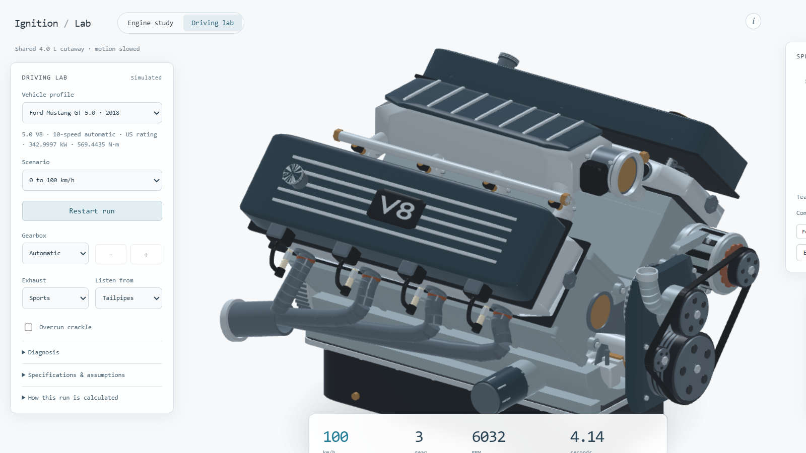

# Ignition Lab

A V8 engine built from equations, with an open Blender assembly. Turn the throttle, follow the pistons, watch pressure become work, and hear the exhaust pulses. Written in strict TypeScript and compiled to native browser modules, with **zero runtime dependencies**.

[](https://github.com/Berkay2002/ignition-lab/actions/workflows/checks.yml)
[](LICENSE)

**[Open the interactive lab](https://ignition-lab-berkay.vercel.app/)** · **[Project showcase](https://ignition-lab-berkay.vercel.app/showcase.html)** · **[Download the Blender scene](https://github.com/Berkay2002/ignition-lab/releases/latest)**

[](https://ignition-lab-berkay.vercel.app/)

## Try it

| Demo | What to explore |
| --- | --- |
| [Assembled](https://ignition-lab-berkay.vercel.app/?view=assembled) | Orbit the engine, click a part, hide or isolate its assembly. |
| [Cutaway](https://ignition-lab-berkay.vercel.app/?view=cutaway) | Follow the pistons, rods, and valve gear while the pressure loop advances. |
| [Exploded](https://ignition-lab-berkay.vercel.app/?view=exploded) | Separate the ten layers and inspect the block, heads, bearings, and sump. |
| [Driving lab](https://ignition-lab-berkay.vercel.app/?mode=drive) | Run acceleration, braking or dyno scenarios; compare six vehicle profiles and record video with sound. |

Drag to orbit, scroll to zoom, or focus the canvas and use the arrow keys. Select a cylinder to follow its cycle. Scrub crank angle to pause and inspect a moment. Adjust RPM, throttle, compression, and ignition advance to solve a new cycle. Sound starts only after you click **Start sound**; it follows engine RPM independently of the slower study animation.

## Calculus you can see

The cylinder volume comes from slider-crank geometry. A Wiebe burn curve releases heat into an ideal gas; a fourth-order Runge-Kutta integrator follows its energy through compression and expansion. The signed area inside the pressure-volume loop gives cycle work:

```math
\begin{aligned}
W &= \oint p\,\mathrm{d}V \\
P_{\mathrm{ind}} &= 8W\frac{\mathrm{RPM}}{120}
\end{aligned}
```

Engine study uses prescribed RPM and a steady cycle. It does **not** simulate crank acceleration, chemical kinetics, CFD, knock, or mechanical losses. The sound is synthesized from exhaust events, not a recording. [Read the equations, assumptions, and validation](docs/model.md).

## Driving and sound

[](https://ignition-lab-berkay.vercel.app/?mode=drive)

[Open the driving lab](https://ignition-lab-berkay.vercel.app/?mode=drive) for 0 to 100, 100 to 200, 80 to 160 km/h, braking, a single-gear dyno sweep, or free drive. Vehicle speed comes from integrated wheel force, traction, drag and rolling resistance. RPM follows gearing and a simplified clutch/shift model. No target acceleration time is prescribed.

Choose an Audi R8, Audi RS 6, Mustang GT, AMG C 63 S, Corvette Stingray or Ferrari 458 profile. Manufacturer peak specifications are sourced; estimated torque curves and unverified inputs are identified in [profile notes](docs/profiles.md). These are model outputs, not measured car performance. The shared 4.0 L engine geometry and original pressure-volume study remain separate from the vehicle models.

Stock, sports and open exhausts change the sound processing. Listen from the tailpipes, engine bay, cabin or roadside. Cross-plane and flat-plane bank cadence, cylinder faults, timing retard and optional throttle-closure afterfire affect the generated waveform. The sound is an approximation, not an authenticated recording of a named car. A privately supplied Audi recording informed broad spectral tuning; it is not distributed or used as a playback layer.

[Hear three generated 100 to 200 demos](https://ignition-lab-berkay.vercel.app/showcase.html#driving). These files run the same vehicle model and audio processor offline.

Completed scenarios can be overlaid and exported as JSON. Record video + sound captures the engine, calculated telemetry, trace, generic pressure-volume reference and synthesized audio locally. Compare the last two clips and download them. Recording stops at scenario completion or after 60 seconds; browser codec support varies. [Calculation, recording and validation details](docs/driving.md).

## Open 3D assets

1,494 named parts in ten groups: block, crank and pistons, main bearings, oil pan, cylinder heads, valvetrain, valve covers, intake, exhaust, and timing/flywheel. The detailed assembly includes recessed hex fasteners, hollow pistons with valve reliefs and wrist-pin bores, ignition coils and leads, fuel rails and injectors, an alternator and belt drive, a water pump, starter, oil filter, pickup and windage tray. Machined nameplates, cast ribs and swept headers complete the exterior.

| Asset | Use |
| --- | --- |
| [v8-engine.blend](https://github.com/Berkay2002/ignition-lab/releases/latest/download/v8-engine.blend) | Editable scene, named collections, materials, studio lights, and an explosion controller. Saved and checked in Blender 5.2.1. |
| [v8-engine.glb](https://github.com/Berkay2002/ignition-lab/releases/latest/download/v8-engine.glb) | Static assembled interchange model. |
| [Assembled render](v8-assembled.png) / [Exploded render](v8-exploded.png) | Full-resolution studio images. |

In Blender, select **Assembly controls** and change its **explode** custom property. The saved scene has a zero-degree mechanical pose; the browser provides live crank, piston, rod, and valve motion. The latest detail pass, materials, GLB and studio renders were built in Blender 5.2.1. This is educational geometry, not manufacturing CAD.

The sound uses separate cross-plane exhaust banks, shaped blowdown pulses, lossy pipe reflections and resonant body tones. Pressure-derived load changes the strength and brightness; RPM and load transitions are smoothed. It is tuned procedural audio, not a calibrated acoustic simulation. [Play the idle/rev/coast demo](https://ignition-lab-berkay.vercel.app/showcase.html#sound), or use Start sound in the lab to see the actual waveform as you adjust the engine.

<details>
<summary>See the exploded render</summary>


</details>

## Run locally

```sh
git clone https://github.com/Berkay2002/ignition-lab.git
cd ignition-lab
npm ci
npm run dev
```

Use Node 22 or 24 LTS. Open [localhost:8765](http://localhost:8765). The development server recompiles TypeScript and copies changed HTML/CSS; refresh the browser after edits. A modern browser with WebGL is required; audio also needs AudioWorklet and a secure context, which localhost provides.

## Verify and deploy

With dependencies installed:

```sh
npm run check
npm run build
```

The check command runs strict typechecking, formatting checks, a production build, and the tests. Tests cover 81 thermodynamic parameter combinations, geometric constraints, shared crank pins, energy balance and integration convergence. The audio suite covers 45 baseline and 24 extreme configurations, filtering, cylinder faults, cadence and Doppler. Vehicle tests cover all 36 profile/scenario combinations, power bounds, braking traction, shifts and timestep convergence. Asset checks validate mesh normals, the 1,494-part GLB, local references, and compiled JavaScript syntax. GitHub Actions runs these checks on pushes and pull requests.

At the default settings the model produces 663.2 J per cylinder per cycle and 106.1 kW indicated power. The energy residual is 0.042 J; halving the integration step changes work by 0.014 J. These checks establish internal consistency, not agreement with an actual engine.

Vercel runs `npm ci --include=dev` and `npm run build`. TypeScript emits ES2022 modules into `dist/js/`, and `scripts/site.mjs` copies the public pages and assets into `dist/`. Connect a fork to Vercel using the included `vercel.json`; no environment variables or backend are required. TypeScript and Prettier are pinned development dependencies, with versions recorded in the lockfile.

The generated `blender-meshes.js` remains an asset rather than a hand-maintained TypeScript source file. Its data is validated at the typed renderer boundary. The audio worklet is compiled separately; its input messages are checked before updating processor state.

To regenerate the public model and renders with Blender 5.2.1:

```sh
blender --background --python scripts/blender-refine.py -- --templates
blender --background --python scripts/blender-refine.py -- --assembly model/assembly.json --render
```

`model/assembly.json` is the exported zero-degree pose with all layers visible. After changing the browser assembly, replace that snapshot using `JSON.stringify(window.v8Lab.exportAssembly())` in the browser console before regenerating. Rebuild the sound demos with `npm run build`, `node scripts/render-audio-demo.cjs`, and `node scripts/render-driving-demo.mjs`.

## Inside the repo

| File | Responsibility |
| --- | --- |
| `src/engine.ts` | Geometry, burn curve, energy integration, cycle work |
| `src/scene.ts`, `src/assembly.ts` | WebGL assembly, picking, layers, cutaway, explosion |
| `blender-meshes.js`, `src/geometry.ts` | Refined mesh templates and procedural fallback |
| `src/renderer.ts` | Pressure-volume plot |
| `src/app.ts` | Typed UI state, animation, orbit, audio lifecycle |
| `src/exhaust-worklet.ts` | Typed audio processor and message boundary |
| `src/vehicle.ts`, `src/profiles.ts` | Integrated driving model and sourced vehicle profile inputs |
| `src/drive-ui.ts`, `src/recording.ts` | Scenario controls, run comparison, JSON and local video export |
| `src/types.ts`, `src/blender-assets.ts` | Spatial/color tuples, shared contracts, asset validation |
| `model.css`, `ui.css`, `style.css` | Typeset model dialog, shared theme, overlay layout |
| `showcase.html` | Project page, demos, renders, and asset downloads |
| `tests/` | Numerical, audio, and asset verification |
